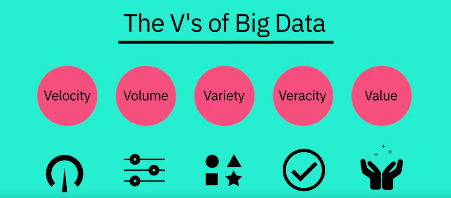

What is Data Science?
=====================

by IBM

# Module 2

## Key Concepts
* Hear from Norman White, the Faculty Director of the Stern Centre for Research Computing, at New York University.
* Hear from Norman White as he talks about data science and what skills are required for anyone interested in pursuing a career in this field.
* Hear from Norman White as he explains some of the popular data science tools and algorithms.
* Hear from Norman White as he gives advice to high schools students, in particular, and anyone, in general, who are looking to start a career in data science.
* Learn about data mining, and the steps the comprise the process of mining a given dataset.
* Learn about regression and what questions can be put to regression analysis.

#
## Title: Data Science Topics

## Big Data and Data Mining

### Foundations of Big Data

* In this digital world, everyone leaves a trace. From our travel habits to our workouts and entertainment, the increasing number of internet connected devices that we interact with on a daily basis record vast amounts of data about us. There’s even a name for it: **Big Data**
* **Ernst and Young** offers the following definition: **Big Data** refers to the dynamic, large and disparate volumes of data being created by **people**, **tools**, and **machines**. It requires **new**, **innovative**, and **scalable** technology to **collect**, **host**, and **analytically** process the vast amount of data gathered in order to derive real-time business insights that relate to consumers, risk, profit, performance, productivity management, and enhanced shareholder value
* There is no one definition of Big Data, but there are certain elements that are common across the different definitions, such as 
	1. **Velocity**
		* **Velocity** is the speed at which data accumulates
		* Data is being generated extremely fast, in a process that never stops
		* Near or real-time streaming, local, and cloud-based technologies can process information very quickly
	1. **Volume**
		* **Volume** is the scale of the data, or the increase in the amount of data stored
		* *Drivers* of volume are the increase in data sources, higher resolution sensors, and scalable infrastructure
	1. **Variety**
		* **Variety** is the diversity of the data
		* Structured data fits neatly into rows and columns, in relational databases while unstructured data is not organized in a pre-defined way, like Tweets, blog posts, pictures, numbers, and video
		* **Variety** also reflects that data comes from different sources, machines, people, and processes, both internal and external to organizations
		* *Drivers* are mobile technologies, social media, wearable technologies, geo technologies, video, and many, many more
	1. **Veracity**
		* **Veracity** is the quality and origin of data, and its conformity to facts and accuracy
		* Attributes include consistency, completeness, integrity, and ambiguity
		* *Drivers* include cost and the need for traceability
	1. **Value**
		* **Value** is our ability and need to turn data into value
		* Value isn't just profit. It may have medical or social benefits, as well as customer, employee, or personal satisfaction
		* The main reason that people invest time to understand Big Data is to derive value from it
		

		  
		

* **Velocity**: Every 60 seconds, hours of footage are uploaded to YouTube which is generating data. Think about how quickly data accumulates over hours, days, and years
* **Volume**: The world population is approximately seven billion people and the vast majority are now using digital devices; mobile phones, desktop and laptop computers, wearable devices, and so on
	* These devices all generate, capture, and store data -- approximately 2.5 quintillion bytes every day. That's the equivalent of 10 million Blu-ray DVD's
* **Variety**: Let's think about the different types of data; text, pictures, film, sound, health data from wearable devices, and many different types of data from devices connected to the Internet of Things
* **Veracity**: 80% of data is considered to be unstructured and we must devise ways to produce reliable and accurate insights. The data must be categorized, analyzed, and visualized
* **Tools** such as **Apache Spark**, **Hadoop** and its ecosystem provide ways to **extract**, **load**, **analyze**, and **process** the data across **distributed compute resources**, providing new insights and knowledge

### What is Hadoop?

* In a big data cluster what Larry Page and Sergey Brin came up with is very simple is they took the data and they sliced it into pieces and they distributed each and they replicated each piece or triplicated each piece and they would send it the pieces of these files to thousands of computers first it was hundreds but then now it's thousands now it's tens of thousands 
	* Then they would send the same program to all these computers in the cluster.
	* Each computer would run the program on its little piece of the file and send the results back
	* The results would then be sorted and those results would then be redistributed back to another process
	* The first process is called a map or a **mapper process** and the second one was called a **reduce process**
* One thing that's nice about these big data clusters is they scale linearly
	* You had twice as many servers and you get twice the performance and you can handle twice the amount of data

### How Big Data is Driving Digital Transformation

* Digital Transformation affects business operations, updating existing processes and operations and creating new ones to harness the benefits of new technologies
* This digital change integrates digital technology into all areas of an organization resulting in fundamental changes to **how it operates** and **delivers value to customers**
	* It is an organizational and cultural change driven by Data Science, and especially Big Data
* The availability of vast amounts of data, and the competitive advantage that analyzing it brings has triggered digital transformations throughout many industries
	* **Netflix** moved from being a postal DVD lending system to one of the world’s foremost **video streaming providers**
	* the Houston Rockets NBA team used data gathered by overhead cameras to analyze the most productive plays
	* Lufthansa analyzed customer data to improve its service
* Digital transformation is not simply duplicating existing processes in digital form
	* the in-depth analysis of how the business operates helps organizations discover how to improve their processes and operations, and harness the benefits of integrating data science into their workflows
* Most organizations realize that digital transformation will require fundamental changes to their approach towards data, employees, and customers, and it will affect their organizational culture
* Digital transformation impacts every aspect of the organization, so it is handled by decision makers at the very top levels to ensure success
* The support of the Chief Executive Officer is crucial to the digital transformation process, as is the support of the Chief Information Officer, and the emerging role of Chief Data Officer
	* they also require support from the executives who control budgets, personnel decisions, and day-to-day priorities
	* This is a whole organization process. Everyone must support it for it to succeed

### Data Science Skills & Big Data

* Nothing to write down

### Data Scientists at New York University

* Nothing to write down

#### Lesson Summary

* In this lesson, you have learned:
	1. How Big Data is defined by the Vs: **Velocity**, **Volume**, **Variety**, **Veracity**, and **Value**.
	1. How Hadoop and other tools, combined with distributed computing power,  are used to handle the demands of Big Data
	1. What skills are required to analyse Big Data
	1. About the process of Data Mining, and how it produces results

## Deep Learning and Machine Learning

### What's the difference?

* The term big data refers to data sets that are so massive, so quickly built, and so varied that they defy traditional analysis methods such as you might perform with a relational database
* The concurrent development of enormous compute power in distributed networks and new tools and techniques for data analysis means that organizations now have the power to analyze these vast data sets
	* A new knowledge and insights are becoming available to everyone
* Big data is often described in terms of five V's; velocity, volume, variety, veracity, and value
* **Data mining** is the process of automatically searching and analyzing data, discovering previously unrevealed patterns
	* It involves preprocessing the data to prepare it and transforming it into an appropriate format
		* Once this is done, insights and patterns are mined and extracted using various tools and techniques ranging from simple data visualization tools to machine learning and statistical models
* Machine learning is a subset of AI that uses computer algorithms to analyze data and make intelligent decisions based on what it is learned without being explicitly programmed
	* Machine learning algorithms are trained with large sets of data and they learn from examples
	* They do not follow rules-based algorithms
* Machine learning is what enables machines to solve problems on their own and make accurate predictions using the provided data
* Deep learning is a specialized subset of machine learning that uses layered neural networks to simulate human decision-making
	* Deep learning algorithms can label and categorize information and identify patterns
	* It is what enables AI systems to continuously learn on the job and improve the quality and accuracy of results by determining whether decisions were correct
* Artificial neural networks, often referred to simply as neural networks, take inspiration from biological neural networks, although they work quite a bit differently
	* A neural network in AI is a collection of small computing units called **neurons**
		* that take incoming data and learn to make decisions over time
	* Neural networks are often layer-deep and are the reason deep learning algorithms become more efficient as the data sets increase in volume, as opposed to other machine learning algorithms that may plateau as data increases
* Data Science is the process and method for extracting knowledge and insights from large volumes of disparate data
	* It's an interdisciplinary field involving mathematics, statistical analysis, data visualization, machine learning, and more
	* It's what makes it possible for us to appropriate information, see patterns, find meaning from large volumes of data and use it to make decisions that drive business
	* Data Science can use many of the AI techniques to derive insight from data
		* For example, it could use machine learning algorithms and even deep learning models to extract meaning and draw inferences from data
* There is some interaction between AI and Data Science, but one is not a subset of the other. Rather, 
	* Data Science is a broad term that encompasses the entire data processing methodology
	* While AI includes everything that allows computers to learn how to solve problems and make intelligent decisions. Both AI and Data Science can involve the use of big data

### Applications of Machine Learning

* Everybody now deals with machine learning
	* recommender systems are certainly one of the major applications
	* Classifications, cluster analysis, trying to find some of the marketing questions from 20 years ago
	* market basket analysis, what goods tend to be bought together
	* predictive analytics is another area of machine learning
	* Decision trees, Bayesian Analysis, naive Bayes, lots of different techniques
* The nice thing about them is that in packages like R now, you really have to understand how these techniques can be used and you don't have to know exactly how to do them but you have to understand what their meanings are
* Precision versus recall and the problems of over sampling and over fitting
* Trying to determine whether a charge that comes a credit card is fraudulent or not, in real time, is a machine learning problem

#### Lesson Summary

* In this lesson, you have learned:
	1. The differences between some common Data Science terms, including Deep Learning and Machine Learning.
	1. Deep Learning is a type of Machine Learning that simulates human decision-making using neural networks.
	1. Machine Learning has many applications, from recommender systems that provide relevant choices for customers on commercial websites, to detailed analysis of financial markets.
	1. How to use regression to analyze data.

